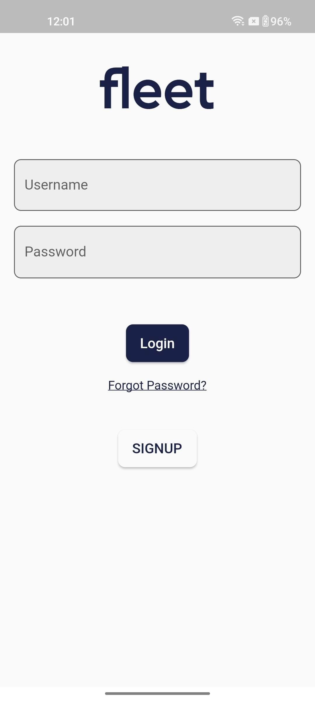

# FleetManagementSystem
## College Project
>Mobile App for Managing Garbage Truck

This project aims to solve the problem that the waste generation rate is higher than the collection rate with the help of a mobile app.


## To Run Project
### Run Backend
1. Install Python
2.  [Clone Backend](https://github.com/gnarayyan/FleetManagementBackend)
3. Navigate to Project directory and install dependencies

    ```shell
    cd fleet_management_system
    pip install -r requirements.txt
    ```
### Run MobileApp
1. Install Flutter in your device
2.  Clone this repository
3. Navigate to Project directory and install dependencies
    `flutter pub get`
4. `flutter run`

### Data Flow Diagram (LEVEL 1)


## Screenshots

### AUTH SCREENS
1. Login Screen


2. Signup Screen


### ADMIN SCREENS
1. Admin Profile


2. Schedule CRUD Operations


### DRIVER SCREENS
1. Driver Profile


2. Add Collection Point


### HOUSEHOLD USER SCREENS
1. User Profile


2. In App Notifications


3. Request for On-Demand-Waste


### HOME SCREEN
